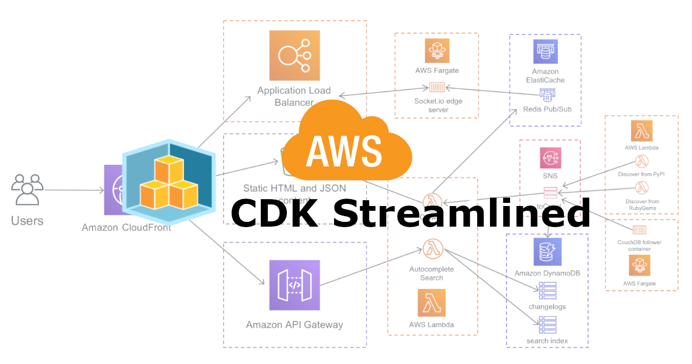

# CDK Streamlined

Repository that acts as a template for AWS CDK applications

## AWS CDK Resources

[Developer Guide](https://docs.aws.amazon.com/cdk/v2/guide/reference.html)
[API Reference](https://docs.aws.amazon.com/cdk/api/v2/docs/aws-construct-library.html)
[CDK GitHub](https://github.com/aws/aws-cdk)
[Opinionated Guide](https://github.com/kevinslin/open-cdk#config)
[Compendium of CDK resources](https://github.com/kalaiser/awesome-cdk)
[Compendium of CDK examples](https://github.com/aws-samples/aws-cdk-examples/tree/master/typescript)
[Compendium of CDK reusable modules]()

## Bootstrap This Repository

1. Install all dependencies: `npm install`
2. Bootstrap the AWS CDK in each AWS account and region where you plan to deploy stacks: `npx cdk bootstrap aws://ACCOUNT-NUMBER/REGION`
3. Rename all `TodoRename` symbols to your application's name
4. Go through all the remaining TODOs.
5. Try out a deployment: `CDK_DEPLOY_STAGE=<stage> CDK_DEPLOY_REGION=<aws_region> npx cdk deploy`
6. Make sure the dummy lambda function is working: `curl -X POST -H 'Content-Type: application/json' -d '{"name": "Your Name"}' <lambda_url_on_terminal>`
7. Start hacking!
